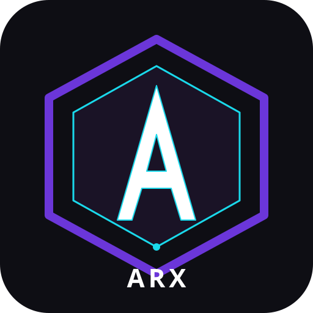

# ARX Engine

> Motor 2D/3D de **apps y juegos** nativo C++, con editor visual estilo Godot,
> scripting propio (**ARXScript**) transpilable a C++ en el export, y
> multiplataforma: **Windows · Linux · Android · Web (HTML5)**.
>
> **Versión: 0.0.0** — esquema de versiones basado en líneas de código:
> cada 50k líneas = +1 versión. 50k→0.0.1, 100k→0.0.2, 150k→0.1.0, etc.



---

## ✨ Características principales

### Núcleo del motor
- **Nativo C++20** con build system CMake.
- **Loop principal** desacoplado del OS (main_loop.hpp) → mismo código para
  editor, runtime y export.
- **OpenGL 3.3+ / GLES 3.0** backend (Vulkan experimental).
- **Renderer abstracto** (renderer.hpp) con batching 2D, meshes 3D, luces
  direccionales y puntuales, y shaders GLSL embebidos.
- **Tipos matemáticos** basados en GLM: `Vector2/3/4`, `Matrix3/4`,
  `Quaternion`, `Color`, `Rect2`, `AABB`, `Transform2D`, `Transform3D`.
- **ClassDB** con registro estático de clases (estilo Godot), properties,
  métodos y signals expuestos a ARXScript y al editor.
- **Variant** tipado dinámico (Nil, Bool, Int, Float, String, Vector2/3/4,
  Color, Rect2, Object*, Array, Dictionary).

### ARXScript — el lenguaje de scripting
- Sintaxis estilo **Python/GDScript**: indentación significativa, `class`,
  `func`, `var`, `if`, `for`, `while`, `match`, `signal`, `enum`.
- Tipado **gradual**: `var x: int = 0` o `var x = 0` (infiersa).
- **Transpilación AOT a C++** al exportar → binario nativo, sin VM,
  **más rápido que GDScript**.
- Decoradores: `export` (propiedad en el inspector), `onready` (inicializa
  en `_ready()`).
- Lifecycle hooks: `_enter_tree`, `_ready`, `_process`, `_physics_process`,
  `_input`, `_draw`, `_exit_tree`.

### Editor visual
- UI con **Dear ImGui**, dock manager estilo Godot (Scene Tree, FileSystem,
  Viewport, Inspector, Output).
- **Splash screen** con tu `splash.png` al arrancar (fade in/out).
- **Project Manager**: crear proyectos nuevos desde plantillas, abrir
  existentes, escanear recientes.
- Inspector con campos por tipo (bool, int, float, string, vector2/3, color).
- Drag & drop en el Scene Tree para reparentar.
- **Viewport 2D/3D** con navegación por ratón (orbit/zoom).

### Exportación (la magia del AOT)
Al exportar a cualquier plataforma, ARX Engine:
1. **Encuentra** todos los `.arx` del proyecto.
2. **Transpila** cada uno a `.arx.cpp` con su clase C++ equivalente.
3. **Compila** el runtime + los `.arx.cpp` con el toolchain de la plataforma
   destino (MSVC, GCC, NDK, Emscripten).
4. **Empaqueta** binario + assets + manifest + icon.

Resultado: el `.exe` / `.apk` / `.html` ejecuta **código nativo C++** sin
VM ni interpretación — exactamente la misma velocidad que si hubieras
escrito el juego en C++ a mano.

### Apps, no solo juegos
ARX Engine está pensado también para **apps**: el template "App Template"
incluye widgets UI básicos (Button, Label, VBox, HBox) y soporte para
diseño responsivo. La diferencia con un juego es solo qué nodos usas en
la escena.

### Librerías third-party (incluidas en `thirdparty/`)
> Son el stack completo de Godot: probadas, optimizadas y bien conocidas.

| Librería | Uso |
|----------|-----|
| **Bullet** 3.24 | Física 3D (rigid body, collision) |
| **FreeType** 2.12 | Render de fuentes TTF/OTF |
| **GLAD** 0.1.34 | Loader OpenGL/GLES |
| **ENet** | Networking UDP confiable |
| **mbedtls** | TLS/DTLS para HTTPS y servidores seguros |
| **libpng / libwebp / jpeg-compressor** | Formatos de imagen |
| **libogg / libvorbis / opus / minimp3** | Audio |
| **libtheora / libvpx / libsimplewebm** | Video |
| **nanosvg** | Render de SVG |
| **recastnavigation** | Navmeshes para AI |
| **rvo2** | Simulación de multitudes |
| **OpenImageDenoise** | Denoising de raytracing |
| **Embree** 3.13 | Aceleración de ray queries |
| **V-HACD** | Decomposición convexa para meshes |
| **xatlas** | Generación de UVs |
| **cvtt / etc2comp / squish** | Compresión de texturas (BC/ETC/PVRTC) |
| **zlib / zstd / brotli** | Compresión general |
| **wslay** | WebSocket client/server |
| **miniupnpc** | UPnP para hostear partidas |
| **pcre2** | Regex |
| **stb_rect_pack** | Atlas de texturas |
| **tinyexr** | Formato EXR (HDR) |

---

## 🆕 Novedades en 0.0.0

Esta versión añade un montón de sistemas nuevos sobre la base inicial:

### Nuevos sistemas completos
- **AudioServer** con soporte WAV/MP3/OGG Vorbis, buses (master/music/sfx/voice), mezcla, fade in/out
- **Input system** con InputMap configurable (acciones → teclas), polling de teclado/mouse/joystick/touch
- **Resource system** con cache + cargadores por extensión (`res://` paths)
- **Scene parser** formato texto `.scene` (como Godot `.tscn` pero más simple)
- **UI system completo**: Control base + Button, Label, ColorRect, Image, Spacer, LineEdit, Slider, ProgressBar, CheckBox, VBox, HBox, Grid, ScrollContainer, Window, OptionButton, TextEdit + FocusManager
- **Animation system**: AnimationPlayer (keyframes por track), SpriteFrames (2D frame-by-frame), Tween (procedural con 11 transiciones + 4 eases)
- **Particles 2D y 3D** con emisión, lifetime, gravedad, dirección, spread, color
- **TileMap 2D** + TileSet con atlas de texturas
- **Nodos físicos 3D**: RigidBody3D, StaticBody3D, KinematicBody3D, CharacterBody3D, Area3D, CollisionShape3D, RayCast3D (todos integrando Bullet)
- **Nodos físicos 2D**: RigidBody2D, StaticBody2D, CharacterBody2D, Area2D, CollisionShape2D, RayCast2D
- **Nodos 3D extras**: Sprite3D (billboard), MultiMeshInstance3D, Decal, Marker3D, RemoteTransform3D, VisibleOnScreenNotifier3D, Skeleton3D
- **Networking high-level** sobre ENet (server/client + RPC)
- **Navigation server** con pathfinding (wrapper Recast/Detour) + NavigationAgent3D
- **Theme system** con 6 presets (Default, Dark, Light, ARX, Cyberpunk, Retro)
- **Save system** JSON + ConfigFile + ProjectSettings
- **I18n / traducciones** con CSV multilenguaje
- **Profiler interno** con frame history y scope timers (`ARX_PROFILE_SCOPE`)
- **JSON parser/serializer** completo
- **Post-process effects**: Bloom, FXAA, Vignette, Blur, ColorGrading, ChromaticAberration
- **Font atlas** con FreeType (render de texto real)
- **StateMachine node** (FSM para gameplay)
- **Camera effects 2D**: shake, follow con smoothing, lookahead, bounds
- **Plugin system** del editor (docks/inspector plugins custom)

### CLI tools
- `arxscript_lint` — valida archivos `.arx`
- `arxscript_format` — formatter con indentación consistente
- `export_template_builder` — genera templates precompilados por plataforma

### Tests unitarios
- `test_math` — tipos matemáticos, clamp, lerp, smoothstep, Rect2, Transform2D, Color, StringID
- `test_arxscript` — lexer (indentación, strings, keywords) + parser (clases, aritmética)
- `test_physics` — Bullet server, gravedad, cuerpo dinámico
- `test_json` — parse, serialize, nesting, tipos

### Conteo de líneas
- **17,169 líneas** de código C++/hpp/.arx (sin thirdparty)
- **152 archivos** en total
- Próxima meta: **50,000 líneas → versión 0.0.1**

---

## 🚀 Quick start

### Requisitos
- **CMake 3.20+**
- Compilador C++20:
  - Windows: **Visual Studio 2022** (MSVC)
  - Linux: **GCC 11+** o **Clang 14+**
  - macOS: **Xcode 14+**
- **OpenGL 3.3+** drivers

### Build (Linux/macOS)
```bash
git clone <tu-repo> arx-engine
cd arx-engine
cmake --preset linux-x64
cmake --build build/linux-x64 -j
./build/linux-x64/bin/arx-editor
```

### Build (Windows)
```cmd
cmake --preset windows-x64
cmake --build build/windows-x64 --config Release
build\windows-x64\bin\Release\arx-editor.exe
```

Ver **[BUILDING.md](BUILDING.md)** para Android (NDK) y Web (Emscripten).

---

## 📚 Documentación

- **[ARCHITECTURE.md](docs/ARCHITECTURE.md)** — diseño del motor, capas, módulos.
- **[BUILDING.md](docs/BUILDING.md)** — instrucciones de build por plataforma.
- **[ARXSCRIPT.md](docs/ARXSCRIPT.md)** — referencia completa del lenguaje,
  con ejemplos.
- **[EXPORTING.md](docs/EXPORTING.md)** — cómo se transpila ARXScript a C++ y
  se compila por plataforma.

---

## 📂 Estructura del proyecto

```
arx-engine/
├── CMakeLists.txt          # Build raíz
├── CMakePresets.json        # Presets Win/Linux/Android/Web
├── thirdparty/             # Librerías C/C++ (Godot stack)
├── src/
│   ├── core/               # types, math, object, variant, logging
│   ├── os/                 # abstracción OS + windowing
│   ├── platforms/          # impls por plataforma (windows/linux/web/android)
│   ├── render/             # renderer + opengl/ + shaders/
│   ├── scene/              # node, scene_tree, 2D/, 3D/, resources/
│   ├── physics/            # physics_server + bullet/ wrapper
│   ├── audio/              # audio_server (minimp3/vorbis)
│   ├── input/              # input + input_map
│   ├── arxscript/          # lexer, parser, AST, transpiler → C++
│   ├── editor/             # editor_main + gui/ + icons/
│   ├── export/             # export_plugin + exporters/ (win/linux/web/android)
│   ├── assets/             # splash.png, app_icon.png, arx_logo.svg
│   └── modules/            # register_module_types.cpp
├── tools/                  # CLI tools (lint, format)
├── docs/                   # documentación
├── tests/                  # unit tests
└── project_templates/      # plantillas: empty_2d, empty_3d, platformer_2d, app_template
```

---

## 🎯 Ejemplo de ARXScript

```python
class Player extends Node2D:
    export var speed: float = 200.0
    var velocity: Vector2 = Vector2(0, 0)

    signal hit(damage: int)

    func _ready() -> void:
        print("Player ready at ", position)

    func _process(delta: float) -> void:
        velocity = Vector2(0, 0)
        if Input.is_action_pressed("ui_right"):
            velocity.x = speed
        if Input.is_action_pressed("ui_left"):
            velocity.x = -speed
        translate(velocity * delta)

    func take_damage(amount: int) -> void:
        emit_signal("hit", amount)
```

→ Al exportar, este archivo se convierte en una clase C++ `Player : public
Node2D`, con `_ready()` y `_process()` como métodos `override`, `speed` como
atributo, y se compila a binario nativo.

---

## 📜 Licencia

MIT (ver `LICENSE`). Las librerías third-party conservan sus licencias
originales (ver `thirdparty/*/LICENSE`).

---

## 🤝 Roadmap

- [x] Arquitectura base + build system
- [x] Core types + Variant + ClassDB
- [x] Renderer OpenGL 3.3+ con batching 2D y 3D
- [x] Scene tree + Node2D/Node3D + Sprite2D/MeshInstance3D/Camera3D/Light3D
- [x] Bullet physics wrapper
- [x] ARXScript: lexer + parser + AST + transpiler a C++
- [x] Editor con ImGui (Scene Tree, Inspector, Viewport, FileSystem, Output)
- [x] Project Manager
- [x] Exporters (Windows, Linux, Android, Web)
- [ ] Runtime VM ARXScript (para iteración rápida en editor sin recompilar)
- [ ] Asset pipeline completo (import de PNG/glTF/OGG con compresión)
- [ ] Animación 2D (SpriteFrames) y 3D (skeletal)
- [ ] Networking high-level (RPC + ENet wrapper)
- [ ] Plugins del editor (inspector plugins, custom docks)
- [ ] Documentación web interactiva
